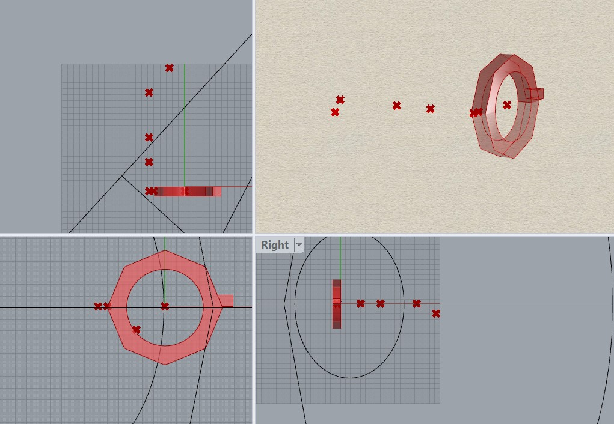

# Wekk 10/30/2023 Progress Report
## Reflections
After completing the mini-me chatbot this week, I feel much more confident in my understanding of how AI can be used to create new tech and custom databases. I did think it was interesting being able to control the information and tone of the bot, but I still do not find this field as interesting as most. 

My biggest struggles this week were with trying to get the model to run well under temperature changes as well as getting the model to understand the chronological aspect of my projects. When I would adjust the temperature all the way up to 2, the model would run for a few minutes and then time out. I eventually got some output to show after lowering the temperature to about 1.4, but I got some very strange output that devolved as the response went on. It went from English, to English gibberish, to complete gibberish in about two paragraphs. I do not understand this enough to fully grasp what is happening here, but I can tell that adjusting the temperature really messes with the model's ability to create concrete and understandable responses. The other problem I was running into was that I'd ask the chat to tell me about the "first" project, meaning the computational design one. I have kept all of the dates and markdown in my knowledge sets, so I figured that it would be able to pull out that one project was "before" the other, but it wasn't. It would just pick one or the other project, and I'm assuming the one it would pull would have the most similarity in the language I was using to ask it. To solve this, I added some lines in the knowledge sets that would either say that it was the first or second project in the class. This seemed to do well, but I think I would need to continue to refine this to make it accurate the entire time. 

Another issue that I ran into was that my responses were pretty lengthy when I was trying to ask for simple overviews of the projects. I tried to tell the bot to be concise, but ultimately had to give it a hard 200 word cap on all of its responses. This seemed to work well but would only give me responses about one of the projects at a time. I then created a knew knowledge set that only had very high-level overviews of each project. This helped, and allowed the model to give some broader responses about the project but I found that I needed to be pretty specific about the questions I was asking. Asking about my "projects" vs. "both my projects" would usually lead to getting a response that had one or both projects in the response. This would also take more time to refine if I wanted to make this fully functional. 

## Speculations
Being able to create custom databases for AI chats seem to be very useful for reducing workload for humans in customer needs. The responses can be more personalized to the customer's questions and provide much more precise answers. I do think that it would require so much testing to ensure that there is accuracy in the response and that a wide variety of language could be used to get the right response. I think that the responses are so dependent on the question semantics and wording that it would need to be trained very well to understand differences in human vernacular. 
# Week 9 10/23/2023 Progress Report
## Reflections
Looking at my work this week, it was very interesting to immediately switch gears from the microcontroller project to AI. To speak truthfully, AI does not really interest me and I am much more interested in physical products, but I know I need to have some familiarity with this project and it will be good to understand how these systems work. I played around with inserting different instructions to the product and I landed on making it use a Midwestern accent to feel a little bit more like home. 

So far, I've been able to upload all of the contents of my Github into two different knowledge sets that are broken up by project. When I ask the assistant for information about the project, it gives me a very verbose and long answer, so I am trying to force it to condense its answers, but I may also be asking the wrong questions. I think I need to add a little bit more context to the information in the knowledge sets so that it can parse through the text easier and find what it needs. I like how the assistant is talking, but I just need to have it be more condensed and succinct, it just hasn't worked yet with the instructions I've given. 

## Speculations
With this, I think it would be really interesting to add this to my own project portfolio and add more information about myself and what I believe in. It would be cool to have this as a design tool that I can recall old techniques or little tricks that I used in older projects. This would help me remember all of the small learnings in each project, and could be a cool way for others to be able to pick my brain about my projects. 

# Week 8 10/15/2023 Progress Report
## Reflections
This week, we needed to finish and finalize our method for generating tones and then integrate the two photons together. Despite all of the effort in using Tone,js, we decided to move away from it because Touchdesigner offered an easier integration and we could also add the visual aspects to the project. Touchdesigner is able to read information off of the serial port, so all we needed to do was have one photon send frequencies everytime that a sensor was triggered. I started by using my random tone generator function that I wrote last week to write to the Serial port. After that, I watched some tutorials to integrate microcontroller data into Touchdesigner. 

Once I could read the data, I started making the code necessary to generate the tones. I found a trigger block that is able to create an amplitude envelope where I could change the attack, decay, sustain, and release of a signal. I shortened the attack and lengthened the decay and release to mimic the sound profile of a ringing chime. I then passed this into an audio oscillator that produces tones at a certain frequency. Using the amplitude trigger allowed me to control the volume of the tone and it produced very realistic sounding tones for chimes. I then layered another frequency one octave higher that helped make a more realistic chime sound. I was using the frequency numbers output by the photon to control the frequency parameter in the audio osciallator to change the notes of each of the chimes. 

Next, I started working on the visuals in Touchdesigner. I have made audio-reactive visualizers before, so I used a lot of my previous code to do this. I created a circle that becomes "noisy" whenever the tone is triggered. The noise is applied to the radius of the cirlce so it distorts whenever the trigger goes off. I used a feedback loop to add some visual "decay" to the distortion and passed in the amplitude envelope to the opacity of the circle so it looks like it comes "alive" whenever it is triggered. I could see this part of the project being developed more, but I am happy with where it is and how it functions. 

Integrating the two photons was relatively simple code-wise, but the connectivity issues with the photon were frustrating to work through. Once everything was claimed and connected to the internet, we were able to publish the frequencies every time a sensor read data and then subscribed with the other one that was connected ot my serial port. 

Here is the working model video! 

[Video of Working Chimes](https://youtu.be/qMnDEDDbK08)

## Speculations
I see the value in being able to connect the photons through wifi, and it could allow for some very cool audio-visual experiences I think. Whatever data being sensed could easily be transmitted to a laptop that could then use Touchdesigner to make the visuals. I really enjoyed making the visuals for this project and would want to continue to do so in future projects. The chimes could be very easily scaled up into an art exhibit where the user becomes the striker of the chimes. We were thinking of having the user sit on a swing and as they move around they trigger the noises and the Touchdesinger graphics could be projected onto the floor. I like how this project came out and the implications that it has for my work in art installations. 

# Week 7 10/08/2023 Progress Report
## Reflections
The big task for me this week was to figure out how to create different tones that could be played when the sensor data is sent to my photon. The first photon will be located on the chimes itself, and then will send over data that shows which sensor was activated and the changes in distance detected by the sensor. This will correspond to my photon, which will then interpret the data to trigger a certain tone for a duration that corresponds to the distance changes. 

We were pointed towards Tone.js to use for sound since it is browser based and would not require using the bluetooth capabilities on the photon 2 since they are unable to connect to typical bluetooth speakers. I started looking at Tone.js but I was not really sure how to set it up to use it. I wanted to utilize its synth generator and add reverb to make the ringing effect of the chimes that could be adjusted so it seemed like one chime got "hit" harder and therefore output at a louder tone and decay for longer. However, I felt that there was a very steep learning curve to integrating this into particle despite getting the very brief introduction to webhooks from Marek during the presentation. After consulting with Jeff, I decided to just start with the tone() function that is built into particle to get started. This would require a speaker to be used on the device which I don't have, but I found a way to work around that. 

To start, I found a list of common notes for wind chimes and found a dataset of frequencies for all tones that can be generated on the particle. I made variables that for each note and created a list containing those notes. Because we do not have the sensor data fully set up yet, I decided to use a random number generator to get a similar functionality to the chimes. I used a random number generator to pick out a tone from an index of note frequencies that could be played and then set a random note duration as well. Once I selected a note and duration, I could pass this into the tone function and generate a tone on a speaker. I decided to just print the frequencies to check that the tones were producing at random. This is working, and it will be easy to integrate the data from the other photon soon. 

[CODE GENERATED](Media/ProjectTwo/generateTone.ino)

## Speculations
I want to integrate Tone.js into this project because I want to have more control over the note production. I spent some time going through a lesson on synth generation through Ableton and I understand the theory behind tone generation much more now. For this project, we would need to make sounds with short attacks and variable sustains and decays. We can add some reverb onto the tone and this would give the effect of the chimes ringing effectively. I really want to make high quality sounds and connecting it through my browser would be the easiest way to then connect to a speaker, so doing this it would elevate the chimes even more so. 

# Week 6 10/01/2023 Progress Report
## Reflections
This week, I joined the laser wind chime group and we began iterating through our ideas. Our goal is to put a Bay-area spin on wind chimes and remove the tubes and replace them with infrared sensors that can detect when the wind blows the striker into the position of the chime. We brainstormed between ideas of using actual lasers and sensors that would have a binary on/off mechanism to trigger the chime tone to play through the speakers and then using infrared time-of-flight sensors that could detect distance between the sensor and the striker. We decided to pursue the infrared sensors as they will allow us to create more variation in the tone and volume of the strikers by calculating how fast the striker enters/exits the field of vision of the sensor. We have created an initial sketch of our idea here. 

We ordered the sensors and while we are waiting to receive them, I wanted to get familiar with distance detection and decided to use the ultrasonic sensor in the kit to do so. I found some wiring diagrams to connect the sensor to the photon and then tried to code the sensor. I realized that I am not very familiar with the syntax of VSCode and the use of the sensor. I had to look up some code to get the sensor working, and compiling the code that I got became difficult. I needed to change how the variables were delcared and eventually got the code to compile. However, when I flashed the code to the device, I started receiving some strange values in the serial monitor. The values should have been printing out in inches, but I was not sure what I was seeing. The data also did not seem to change as I moved my hand closer and farther from the sensor, so I will need to keep digging into the code and better understand what I am using. 

 

## Speculations
With this project, I see the outcome being able to be scaled into an immersive art project. I would love to have a person become the striker, where they could sit on a swing and move around and trigger the different tones. We would also like to incorporate more visual aspects to the project, and would like to use Touchdesigner to create visuals that could be projected onto walls in a room or on the floor around the person. I would like the visuals to be audio reactive and help create a more peaceful and immersive experience to the user when they enter the space. Photon can integrate pretty easily into Touchdesigner, as the serial port can be read and integrated into creating noise and variation in the visuals. I would imagine some large circles being projected onto a screen and as the chimes are triggered the circles pulse and decay just as the tone does. I think that this will allow to connect the user to the piece a whole lot more than just with audio. 

# Week 5 09/25/2023 Progress Report
## Reflections
This week I battled. I am pretty familiar with building circuits on breadboards and got the blinking light and light sensor, so I started working with Jeff on gaining some familiarity with VSCode. This was the primary reason for my insanity this week, as the code would not run for me after going through all of the setup in class. I was getting an error that just immediately could not compile the code shown below. 

Thanks to some slack troubleshooting, I realized that I had a space in my username on my computer, which could not be solved from a simple rename in the file explorer. I eventually found [this video](https://www.youtube.com/watch?v=w5N2aaiToiQ) that was able to walk me through changing my name and getting things to complile. Once I was able to get my code to compile, I then ran into another error that I could not resolve immediately. 

Thankfully, this ended up being a quick fix and I just needed to switch a setting to run on the Photon 2 platform instead of something else. Once this switch was made, I was able to compile and flash the code to the Photon and got Jeff's altered "Hello World" code to run. Both the compiling and flashing of the code takes a somewhat significant amount of time, so I may need to transition to just using the Web IDE to make this process work faster for me. The output of the code is shown below. 

## Speculations 
With the ideation session in the Monday class, I am very excited to work on the three projects that I chose. I wanted to work on the projects that created a whimsical connection between people, and looked at the Meditation Flower, Mental Health Communicator, and Laser Wind chime projects. I have been tossing around ideas surrounding reflective meditation tools, because I feel that when I meditate, once I am finished I often just go about my day. It would be nice to have a tool that interacted with me and could show me more reflections on how I felt in certain times. I also am very interested in the mental health alert system that I helped develop in the Monday session. The idea is that when someone is experiencing a certain emotion, they are able to choose to broadcast out to their friend network through the use of ambient lighting in a room. The color of the light and a small display could show the emotion and who is experiencing it and what they might need from everyone else. What I really liked about this idea is that it has persistent connection that is not obtrusive to one's life. People are free to choose to display their emotions or not, and it is a way that could alert many friends at once to show them what someone might need at that time. I hope that this can get developed and I see a lot of potential for better connectivity with this object. The reason I like the laser wind chimes is that it offers another way to interact with chimes. Usually, you would have to rely on the randomness of wind, but by including lasers in this, it gives the user a new way to play with sound. 
# Week 4 09/18/2023 Progress Report
## Reflections
I was very excited to hear about this new project that we are going to be working on. When Jeff was giving his presentation, my mind already started buzzing with ideas of what I could do. I have used microcontrollers before, so I really want to push myself on this project and create something that is very aesthetically pleasing and functions well. I am hoping to combine some aspect of music and lights into the project but I am not sure exactly what I want it to be yet. I was playing around with the idea that there could be a way to process information about the song, i.e. the bpm or energy levels, that would then map to a color pallette. Then I could 3D print these orbs that could difuse the light and become decorative pieces that are music reactive in my room. I want to keep refining this idea but I think that they could be very cool products that I could have as decorations. 

I was able to setup the photon pretty easily, but I had some troubles with the usb connection at first. My computer wasn't recognizing that there was anything input into the port but the photon was flashing blue indicating that there was power. I had to eventually switch out the cables and then my computer was able to recognize it. The process went smoothly and I was able to connect my photon to the IOT wifi. 

## Speculations
I know that microcontrollers are used in a vast variety of products, but I really like the idea of them being sensing devices that then create reactive art. I would love to pursure more interactive and educational pieces of art that teach or inspire wonder about technology and creativity. When I think about this, I often think about the exhibits at the exploratorium and how they are able to leverage technology to be an educational and fun interaction for people. We are already so integrated with technology in our daily lives, but there is not as large of a desire to understand how it all works. I would love to use microcontrollers to help create more understanding and bridge the gap between tech and people. 

# Week 3 09/11/2023 Progress Report
## Reflections 
[Watch my Youtube Video explanation Here](https://youtu.be/fW_C_lz0i7k)

I wanted to continue working on something that protected me from the sun this week, and I was inspired by my recent purchase of some sunglasses that do not quite fit my face perfectly. It was hard to tell the sizing on their website and I need to get a new pair that truly fits my face. I really liked the funky design on the pair that I purchased, so I wanted to create something that was equally fun and still provided enough customization to allow for a perfect fit on my face. I really wanted to challenge myself as I had never coded anything from scratch in grasshopper, so I wanted to move away from the phone stand and start building something that was completely unique. I have done a lot of 3D printing and laser cutting as well, so I wanted to put a lot more time into the code and skip out on creating something physical. 

I started with creating the frames of the glasses. Orignally, I had created cylindrical frames as I had not yet discovered the polygon tool yet. I found it easy to create the objects and then remove the material from the center, but the first challenge I ran into was creating the bridge of the glasses. I knew I wanted to have the bridge be able to move up and down in relation to the frames, but as I changed the Z component of the box, I saw that there were gaps between the bridge and frame. I had orignally set the origin of the box to be on the tangent edge of the frames, but this always left a gap. I had already created the cutout for the lens at this point, so I was trying to play with a way to keep the origin within the frame material, but this still left me with gaps as it moved farther up. To fix this issue, I realized that I could move the origin of the box to the center of the frame, combine it with uncut frame, and then create the cutout. This gave the bridge enough length to always be connected to the frame and move up and down with any gaps. 

When I moved onto the arms of the glasses, I realized that I would have the same issue as with the bridge, so I decided to just start by creating my base shape in the middle of the glasses right away. I knew that I wanted to use the sweep function to create a more natural looking arm shape. I discovered the polygon tool at this point, and knew that I wanted the shape of the arm to be customizable to have shapes that ranged from triangles to octagons. I then created my points for the sweep and linked all of them to have the same Z component as the bridge of the glasses so that they moved in unison. For two of the points in the middle of the array, I gave them an extra slider that allowed for further movement in the Z direction. Once I had all of my points, I created the sweep with the base polygon. This extended from the middle of the frames. I tried to combine this in the merge block that I used with the brige and frames, but it did not seem to work. I eventually had to create another merge and union block before subtracting the cutout from the frames. This worked, but created a linkage visual in the code that I was unsure about and had to lookup. This double dashed line meant that multiple lists of data items are transferred between the blocks. 

The arms were extruding correctly, but had a little bit excess material that was outside of the thickness of the frames. In order to get rid of this, I needed to move the origin of the cutout to be farther in the frames so that it cut out everything. This worked well and covered all of the potential shapes that I had allowed the users to choose.  

My final challenge is getting the frame to mirror to create the other side of the glasses. To make things simpler for myself and to reduce the redundancy, I wanted to only model half of the frames and then try to mirror them across a plane that was coincident with the inside edge of the bridge. However, because I was allowing the bridge to change length, I could not create a static plane to input into the mirroring function. I needed to find a way to construct a plane that always existed on the surface of the bridge. After some searching around, I found that I could deconstruct Breps and pick out certain vertices on the object. I was able to use this to find three vertices on the edge of the brep and then input those into the plane function. This plane would always take in my points when they changed and stayed on the right surface of the bridge. With this mirroring, I was able to construct only half the frame and reduce a lot of the work I orignally thought I was needing to do. 

With all of this completed, I was able to create a fully functioning model of customizable sunglasses. The video linked at the beginning of the report shows all of the functionality, and the grasshopper file is located [here](Media/Sunglasses/sunglasses.gh) as well.

## Speculations
This was a very enjoyable project for me. I think that while this is a very rough and maybe not very attractive product, allowing the parametric modeling to be included into something like fashion and wearables. This reminds me of the dress that Cody shared with us during his presentation. If we are able to get exact measurements off of a person and then relatively quickly 3D print a fully custom piece of apparel, then there could be a lot less waste. It is fast fashion, but in a completely different sense than what is typical at the moment. With development into different materials, it could be feasible that you could print a perfectly fitting T-shirt that is lasts someone for awhile. With the ability to customize different aesthetic features, this could greatly reduce the amount of fashion waste and still allow people to be unique in how they dress. 

# Week 2 09/04/2023 Progress Report
## Reflections 
This week I wanted to focus on becoming more familiar with the parametric modeling in Grasshopper. As I have made my way from the Midwest to Sunny California, I have noticed that the need for shade is vastly higher, not only for me but for my phone as well. I wanted to play with the idea of adding a little umbrella to the model, not for anything truly practical but more for fun. The goal was to have mesh a cone and cylinder together to create the umbrella shape and then have it rotate around the phone stand as the viewing angle of the phone also changed. My original idea for this week was to add a party hat to the stand because it looked somewhat head-shaped, but after playing around with the settings of the cone and trying to align it to the sphere, I saw that it could be used as an umbrella and went forward with that idea. The ultimate goal would be to have an umbrella that never collides with the phone, meshes perfectly into the base of the stand, and is fully adjustable in height and size. 

Using the simplified model provided by TJ, I started to play around with the settings of the phone stand itself to generate something that fit my phone and looked good to me. Once I had that shape, I began working on constructing the cone in Grasshopper. Ideally, the distance from the bottom edge of the cone to the phone should adjust as the dimensions of the phone change, but as my grasshopper became more and more complex, I feel like I need to clean up and reorganize before I draw too much information from the phone so that my code is still readable. I eventually ended up just using a slider to adjust the height of the cone away from the sphere. I had to generate vectors to adjust the origin of the cone because I figured that the shading of the phone could be done with multiple angles, not just directly over the phone. I used the following segment of code to do that. 

![Grasshopper Code that shows the vector coding][VectorTransform]

That allowed me to move the cone however I wanted in a single orientation, but I needed to change the angle of the cone so that as the phone viewing angle changed, the umbrella would not interfere with the spot where the phone rested in the stand. Using a rotation block, I inputted the phone viewing angle, learned I needed to convert to radians after awhile, and then outputted the rotated geometry. Once, I did this, I realized that the viewing angle was the angle of the phone face relative to the table and not the angle of the body to the table, so I needed to subtract 90 degrees in order for the cone to be orthogonal to the phone screen face. Once I did this, the cone mimicked the angle of the phone and moved smoothly with the changes in the angles. 

I repeated this process for the pole of the umbrella, which consisted of just a thin cylinder that originated at the base of the stand. The length of the pole is derived from the Z height of the cone. The rotation was copied from the cone, but I noticed that the end of the cylinder was poking out the underside of the phone base, so I needed to copy the rectangular void that created the table surface and then add another shape difference to make sure that the flat plane remained on the bottom of the stand. One issue that I am still working through is connecting the pole and cone to be one object. I need to work out the height mathematically so that the pole always touches the cone but does not go through it. Then once this is fixed I will create a shape union to combine the umbrella with the base of the phone stand. 

## Speculations
I think that this week gave me a good insight into the mechanics of Grasshopper and what I could do with it. If I were to keep moving forward with the umbrella on the phone stand and create something somewhat useful, I would want to limit the angle of movement of the umbrella so that it remained mostly overhead of the phone as the phone tilted. This way there could still be a response to changes in the viewing angle, but the shade remains mostly overhead. I would also like to change the position of the pole to be located on the stand to be off to the side. This way the pole would not interfere with inserting or removing the phone from the stand. There would be a lot of use to have the umbrella removable as well, as it is not always necessary and would get in the way of photos or videos from the phone. 

# Week 1 08/30/2023 Progress Report
## Reflections
This week was the first week I had ever used Rhino. I came into it thinking it would be similar to other CAD software I've used like Solidworks or Fusion but it was different enough to challenge me. I jumped right into picking apart the cell phone stand file with everything in it because I wanted to see the entire file and how everything fit in. This was a bit overwhelming but I began to pick up on how Rhino and Grasshopper worked. 

I learned a lot about the visual coding system of grasshopper, and while I don't completely understand all of the functions within the file, I understand how things need to connect and how the use of sliders can allow for this became a generative design tool. I was able to use the sliders to generate the visuals of a stand that I wanted to use. I measured my own phone in order to do this, but I got stuck when trying to export the drawings to something that I could use on the laser cutter. I would be able to export the files by selecting them and then using the export command, but often the scale of my parts would be incorrect. Eventually I had to manually resize the bounding box in order to resize the parts correctly. 
The biggest thing I started to learn this week was how parametric modeling could be done in Rhino. The tutorial from TJ helped a lot, but only after I spent about 2 hours parsing through the visual code did I really begin to understand what happened in the file. I do not enjoy learning code like this, but it helped me play around and break the file so that I did understand some of the functions of the files. 

Once I had the file, taking it to laser cut was not much of an issue. As I have lots of experience with laser cutting, the ones in the Makerspace were not too bad. I was able to make a few test cuts with the default settings for plywood, and after a few adjustments my pieces cut out from the scrap perfectly and fit together very well. 

Overall, I think this was definitely more challenging than I had imagined, and I know I have a long way to go to understand something this complex but I have gotten a lot of knowledge from this so far. I think I will need to have more instruction to become better at Rhino and Grasshopper. I was able to laser cut a model of the phone stand with some modifications for my phone, and it seemed to work pretty well and fit my phone correctly. 

## Speculations
I think that as tools like 3D printing and laser cutting get faster and become more accessible, parametric modeling will allow for customization to become common practice in goods. I could imagine something like this, where a company would sell the software, and a user would be able to easily customize a product to their exact needs and produce it in their own home. My hope is that this could potentially create less waste from inaccurate or generic sizing of certain products. If we could generate items such as clothing or shoes that would be custom fit for someone, they could last much longer and have better quality and value to the consumer. This would go against the subscription model of many goods, but it could be a necessary shift to stop meaningless overproduction and waste.  

This tool also reminds me of the article we discussed in Debates in Design by Kate Compton about Casual Creators. Compton discusses tools that help people design and create objects in a way that is much faster and enjoyable for the user. Casual creators don't require lots of training or time for the user to understand how to create, and they give users lots of power to create within some predefined limits established by the tool. There is not a lot of knowledge needed to make the phone stand with this tool. If the interface was made so that the sliders were easy to move and could handle some written input, then this could be considered a casual creator because of how easy it is to create your own design in the model. 

[VectorTransform]: Media/VectorTransformation.jpg
